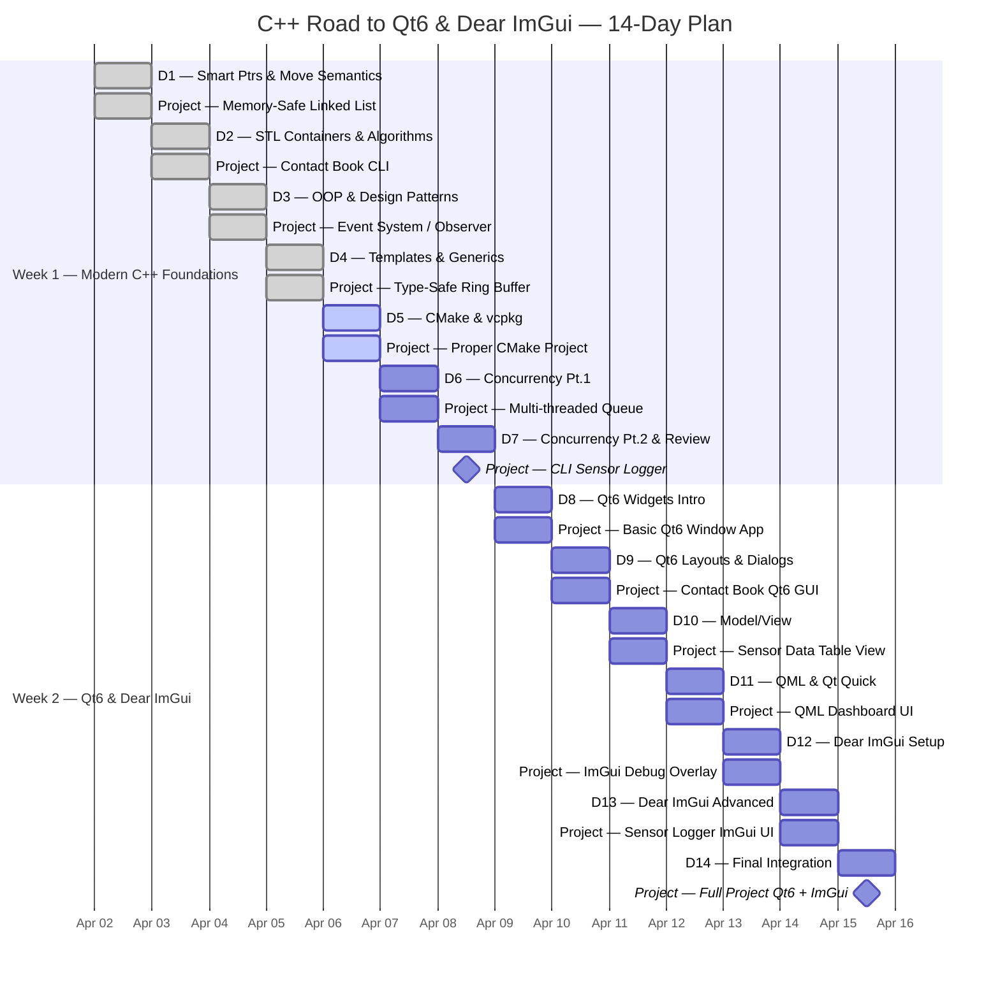

# C++ Learning Map — Road to Qt6 & Dear ImGui
> **14 days · 2h/day · ~28h total** | Intermediate level · Project every day

---

---

## Progress

| | |
|---|---|
| **Status** | Day 5 of 14 — in progress |
| **Completed** | Days 1–4 ✅ |
| **Active** | D5 — CMake & vcpkg ▶ |
| **Remaining** | Days 6–14 |
| **Started** | April 02, 2026 |
| **End date** | April 15, 2026 |

**`[████░░░░░░░░░░] 3/14 (21%)`**

---

## Schedule

---

## Week 1 — Modern C++ Foundations

> **Milestone:** A working multi-threaded CLI sensor logger built entirely with modern C++17.

### ✅ D1 — Smart Ptrs & Move Semantics
**📅 Date:** Thursday, April 02  
**📦 Project:** Memory-Safe Linked List  
**⏱ Theory (45 min):** unique_ptr, shared_ptr, weak_ptr · Rvalue refs, std::move · auto, structured bindings, std::optional

Singly linked list using only `unique_ptr<Node>` — no raw `new`/`delete`. Add move constructor, verify with valgrind.

### ✅ D2 — STL Containers & Algorithms
**📅 Date:** Friday, April 03  
**📦 Project:** Contact Book CLI  
**⏱ Theory (45 min):** vector, map, unordered_map, std::span · std::sort, find_if, transform, ranges · Lambdas & captures

CLI contact manager in `unordered_map`. Sort by name, filter with lambda, print formatted table.

### ✅ D3 — OOP & Design Patterns
**📅 Date:** Saturday, April 04  
**📦 Project:** Event System / Observer  
**⏱ Theory (45 min):** Virtual dispatch, pure virtual, CRTP · Observer pattern (→ Qt signals/slots) · Command pattern

`EventBus`: `subscribe()`, `emit()`, `unsubscribe()` at runtime. At least 3 listener types.

### ▶️ D4 — Templates & Generics
**📅 Date:** Sunday, April 05  
**📦 Project:** Type-Safe Ring Buffer  
**⏱ Theory (45 min):** Function/class templates, partial specialization · Variadic templates, fold expressions · C++20 concepts

Generic `RingBuffer<T,N>`: fixed-size, no heap. C++20 concept: `T` must be `trivially_copyable`.

### ⏳ D5 — CMake & vcpkg
**📅 Date:** Monday, April 06  
**📦 Project:** Proper CMake Project  
**⏱ Theory (45 min):** CMake targets, find_package, target_link_libraries · vcpkg manifest mode · .clang-format / .clang-tidy

Restructure Day 4 into full CMake project. `vcpkg.json` with `fmt`/`nlohmann-json`. Catch2 tests.

### ⏳ D6 — Concurrency Pt.1
**📅 Date:** Tuesday, April 07  
**📦 Project:** Multi-threaded Queue  
**⏱ Theory (45 min):** std::thread, mutex, lock_guard, unique_lock · condition_variable · RAII lock patterns

Thread-safe queue with producer/consumer threads and `condition_variable`.

### ⏳ D7 — Concurrency Pt.2 & Review 🏆 **Milestone**
**📅 Date:** Wednesday, April 08  
**📦 Project:** CLI Sensor Logger  
**⏱ Theory (45 min):** std::async, future, promise · Thread pool basics · Putting it all together

Multi-threaded CLI sensor logger — combines all C++17 patterns.

---

## Week 2 — Qt6 & Dear ImGui

> **Milestone:** A combined Qt6 Widgets/QML + Dear ImGui debug overlay application.

### ⏳ D8 — Qt6 Widgets Intro
**📅 Date:** Thursday, April 09  
**📦 Project:** Basic Qt6 Window App  
**⏱ Theory (45 min):** QWidget, QMainWindow, QPushButton · Signals & slots · Qt Object Model

First Qt6 app: window with buttons, menu bar, status bar using signals/slots.

### ⏳ D9 — Qt6 Layouts & Dialogs
**📅 Date:** Friday, April 10  
**📦 Project:** Contact Book Qt6 GUI  
**⏱ Theory (45 min):** QVBoxLayout, QHBoxLayout, QGridLayout · QDialog, QFileDialog, QMessageBox · Qt Designer

Port Day 2 Contact Book to a full Qt6 GUI with layouts, dialogs, and file I/O.

### ⏳ D10 — Model/View
**📅 Date:** Saturday, April 11  
**📦 Project:** Sensor Data Table View  
**⏱ Theory (45 min):** QAbstractItemModel, QTableView · Custom item delegates · Model/view separation

Custom `QAbstractItemModel` showing live sensor readings in `QTableView`.

### ⏳ D11 — QML & Qt Quick
**📅 Date:** Sunday, April 12  
**📦 Project:** QML Dashboard UI  
**⏱ Theory (45 min):** QML syntax, properties, bindings · Qt Quick controls · C++ ↔ QML bridge

QML dashboard with live sensor gauges, animated transitions, C++ data source.

### ⏳ D12 — Dear ImGui Setup
**📅 Date:** Monday, April 13  
**📦 Project:** ImGui Debug Overlay  
**⏱ Theory (45 min):** ImGui context, render backends · Docking extension · Input & frame loop

Dear ImGui window with docking, real-time plots, and input handling.

### ⏳ D13 — Dear ImGui Advanced
**📅 Date:** Tuesday, April 14  
**📦 Project:** Sensor Logger ImGui UI  
**⏱ Theory (45 min):** ImPlot for real-time graphs · Tables, modals, tooltips · Custom widget patterns

Full ImGui UI: ImPlot sensor graph, tables, modal dialogs, custom widgets.

### ⏳ D14 — Final Integration 🏆 **Milestone**
**📅 Date:** Wednesday, April 15  
**📦 Project:** Full Project Qt6 + ImGui  
**⏱ Theory (45 min):** Polish, packaging, `cmake --install` · README & docs · Final review

Combined Qt6 Widgets/QML + Dear ImGui debug overlay. Packaged with `cmake --install`.

---

## Quick Reference

| Day | Topic | Project | Status | Date |
|-----|-------|---------|--------|------|
| 1 | D1 — Smart Ptrs & Move Semantics | Memory-Safe Linked List | ✅ Done | Apr 02 |
| 2 | D2 — STL Containers & Algorithms | Contact Book CLI | ✅ Done | Apr 03 |
| 3 | D3 — OOP & Design Patterns | Event System / Observer | ✅ Done | Apr 04 |
| 4 | D4 — Templates & Generics | Type-Safe Ring Buffer | ✅ Done | Apr 05 |
| 5 | D5 — CMake & vcpkg | Proper CMake Project | ▶️ Active | Apr 06 |
| 6 | D6 — Concurrency Pt.1 | Multi-threaded Queue | ⏳ | Apr 07 |
| 7 | D7 — Concurrency Pt.2 & Review | CLI Sensor Logger 🏆 | ⏳ | Apr 08 |
| 8 | D8 — Qt6 Widgets Intro | Basic Qt6 Window App | ⏳ | Apr 09 |
| 9 | D9 — Qt6 Layouts & Dialogs | Contact Book Qt6 GUI | ⏳ | Apr 10 |
| 10 | D10 — Model/View | Sensor Data Table View | ⏳ | Apr 11 |
| 11 | D11 — QML & Qt Quick | QML Dashboard UI | ⏳ | Apr 12 |
| 12 | D12 — Dear ImGui Setup | ImGui Debug Overlay | ⏳ | Apr 13 |
| 13 | D13 — Dear ImGui Advanced | Sensor Logger ImGui UI | ⏳ | Apr 14 |
| 14 | D14 — Final Integration | Full Project Qt6 + ImGui 🏆 | ⏳ | Apr 15 |

---

## Overview

| | Detail |
|---|---|
| **Duration** | 2 Weeks |
| **Daily commitment** | Up to 2 hours |
| **Target** | Qt6 (Widgets + QML) + Dear ImGui |
| **C++ standard** | C++17 (C++20 concepts intro) |
| **Build system** | CMake 3.x + vcpkg |
| **Rule** | Every day ends with something you built and can run |
